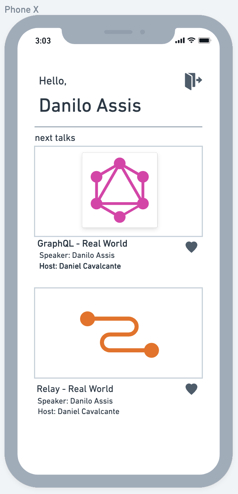
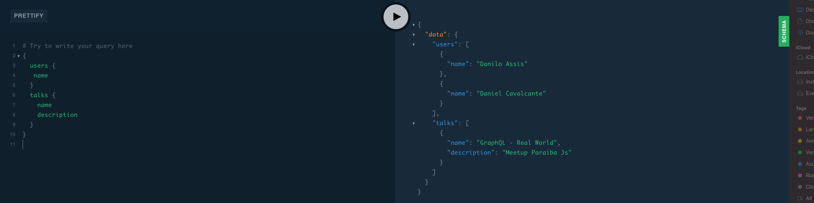
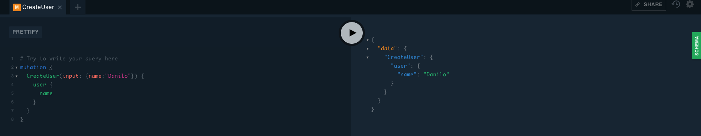
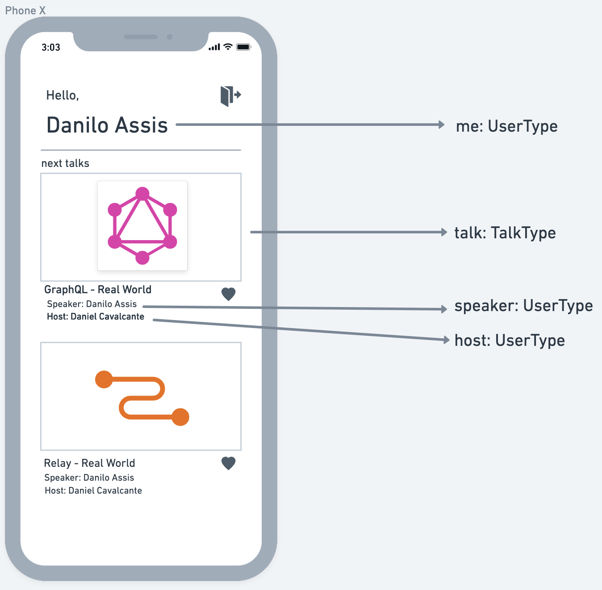
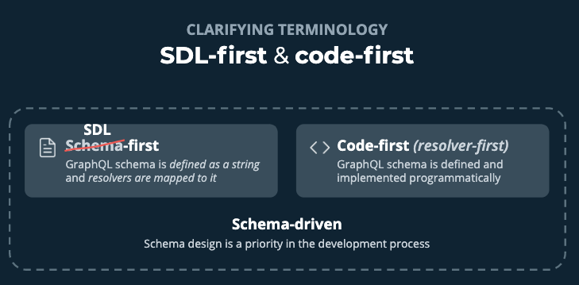
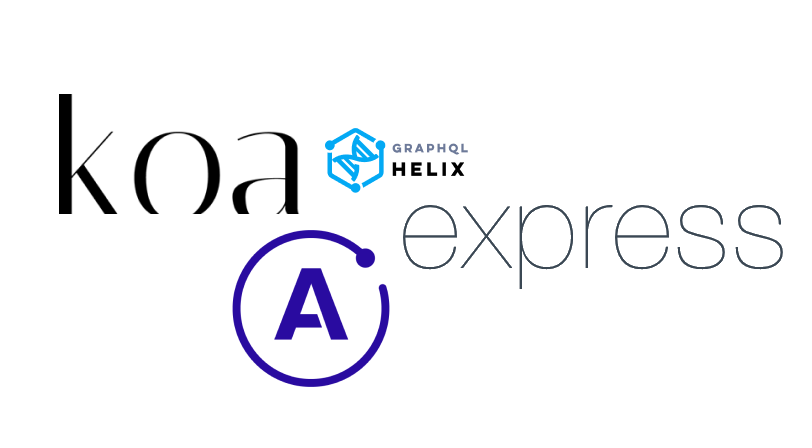
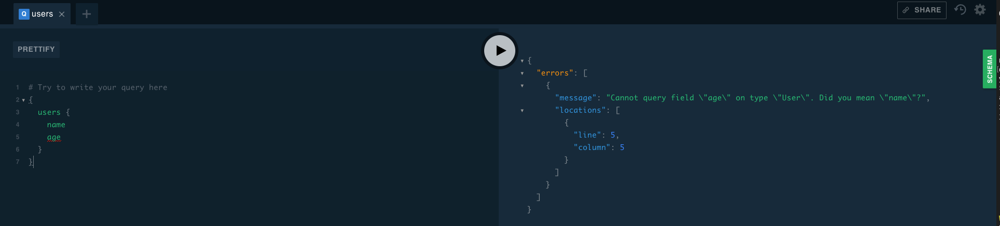
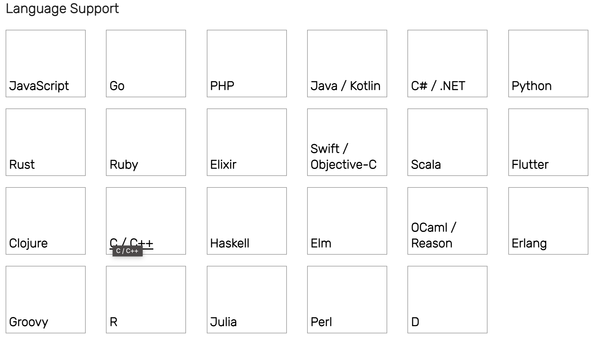

import { Head, Image, Appear } from 'mdx-deck'
import Code from 'mdx-code';
import { CodeSurfer } from "mdx-deck-code-surfer";

import { Cover } from './Cover';
import { Intro } from './Intro';
import { Roadmap } from './Roadmap';
import { Thanks } from './Thanks';
import { Feedback } from './Feedback';
import { Patreon } from './Patreon';
import { Social } from './Social';
import {Img} from './Img'

export { default as theme } from './theme'

<Head>
  <title>GraphQL - Real World</title>
</Head>

<Cover />
---
<Intro />

---
## Overview

<Roadmap />

---
## GraphQL

<ul>
    <Appear>
        <li>launched by facebook</li>
        <li>created on 2012 and open-sourced on 2015</li>
        <li>it was created to resolve mobile team issues on Facebook</li>
        <li>It is a Query language to read and mutate data</li>
        <li>Based on three types: Query, Mutation and Subscription</li>
    </Appear>
</ul>

---

# What GraphQL Solves

<ul>
    <Appear>
        <li>Collocation of data requirements</li>
        <li>Over-Fetching and Under-Fetching</li>
        <li>Evolve APIs without versions</li>
        <li>Strong type system</li>
        <li>Creates a source of truth from the backend</li>
    </Appear>
</ul>

---

# TalkDeck App

---

# Types

<ul>
    <Appear>
        <li>Schema</li>
        <li>Query</li>
        <li>Mutation</li>
        <li>Subscription</li>
    </Appear>
</ul>

---

# Schema Type
<ul>
    <li>Entry Point</li>
    <li>Embraces the three types</li>
    <li>Source of Truth</li>
</ul>

---

# Query Type
<ul>
    <li>Represents a data</li>
    <li>Read</li>
    <li>JSON</li>
    <li>"I want a User and his/her name"</li>
</ul>

---

# Query Example

---

# Mutation Type
<ul>
    <li>Mutate a data</li>
    <li>Write followed by a Read</li>
    <li>JSON</li>
    <li>"I want to create a new User"</li>
    <li>"Please, return the name at the end of creation"</li>
</ul>

---

# Mutation Example

---

# Subscription Type
<ul>
    <li>Listen an event</li>
    <li>Pub and Sub</li>
    <li>JSON</li>
    <li>"You receive a new like in your talk"</li>
</ul>

---

# TalkDeck Types

---

# SDL First vs Code First

---

# SDL First vs Code First
<ul>
    <li>Defines the GraphQL Schema Types</li>
    <li>Works as a contract between frontend and backend</li>
    <li>Schema first: we define the schema and make the code match with it</li>
    <li>Code first: we code first and then the code generates our schema</li>
    <li>Both schemas are generated with SDL (System Definition Language)</li>
    <li>The choice is opinionated</li>
</ul>

---

<CodeSurfer
  title="SDL First - schema.graphql"
  code={require('!raw-loader!./schemagraphql.ts')}
  showNumbers={false}
  dark={true}
  lang="typescript"
  steps={[
    { range: [1, 12], notes: 'Mutation'},
    { range: [14, 21], notes: 'Query'},
    { range: [23, 33], notes: 'Subscription'},
    { range: [34,50], notes: 'Types'},
  ]}
/>

---

<CodeSurfer
  title="Code First - schema.ts"
  code={require('!raw-loader!./schema.ts')}
  showNumbers={false}
  dark={true}
  lang="typescript"
  steps={[
    { range: [1, 10], notes: 'Schema'},
    { range: [6, 10], notes: 'Schema'},
  ]}
/>

---

<CodeSurfer
  title="Code First - QueryType"
  code={require('!raw-loader!./queryType.ts')}
  showNumbers={false}
  dark={true}
  lang="typescript"
  steps={[
    { range: [1, 99], notes: 'Query Type'},
    { range: [1, 24], notes: 'Mocks'},
    { range: [26, 31], notes: 'Query Field Declaration'},
    { range: [32, 34], notes: 'Version Field'},
    { range: [36, 41], notes: 'Me Field'},
    { range: [42, 47], notes: 'Users Field'},
    { range: [48, 62], notes: 'User Field'},
    { range: [63, 68], notes: 'Talks Field'},
    { range: [69, 84], notes: 'Talk Field'},
  ]}
/>

---

# HTTP Servers

---
## Feel free to check
<ul>
    <Appear>
        <li>Express - <a href="https://expressjs.com/">https://expressjs.com/</a></li>
        <li>Koa - <a href="https://koajs.com/">https://koajs.com/</a></li>
        <li>Apollo Server - <a href="https://www.apollographql.com/docs/apollo-server/">https://www.apollographql.com/docs/apollo-server/</a></li>
        <li>GraphQL Helix - <a href="https://github.com/contrawork/graphql-helix">https://github.com/contrawork/graphql-helix</a></li>
    </Appear>
</ul>

---

# Frontend Clients

<ul>
    <li>Relay - <a href="https://relay.dev">https://relay.dev</a></li>
    <li>Apollo - <a href="https://www.apollographql.com/docs/react/">https://www.apollographql.com/docs/react/</a></li>
    <li>urql - <a href="https://formidable.com/open-source/urql/">https://formidable.com/open-source/urql/</a></li>
    <li>graphqlurql - <a href="https://github.com/hasura/graphqurl">https://github.com/hasura/graphqurl</a></li>
</ul>

---

# GraphQL BaaS

<ul>
    <li>Apollo Studio - <a href="https://www.apollographql.com/docs/studio/">https://www.apollographql.com/docs/studio/</a></li>
    <li>AWS AppSync - <a href="https://aws.amazon.com/pt/appsync/">https://aws.amazon.com/pt/appsync/</a></li>
    <li>Back4App - <a href="https://www.back4app.com/">https://www.back4app.com/</a></li>
    <li>Hasura - <a href="https://hasura.io/">https://hasura.io/</a></li>
</ul>

---

# Handling Errors

<ul>
    <li>Avoid status codes</li>
    <li>Specific field for server errors</li>
    <li>Specific Field for query, mutation, subscription error</li>
</ul>

---

# GraphQL Error Example

---

# Tests
<ul>
    <li>Jest</li>
    <li>Common scenarios: Queries, Node Queries, Mutation</li>
    <li>Do a normally request passing into the body graphql string</li>
    <li>Mock you database</li>
    <li>Common scenarios: Queries, Node Queries, Mutation</li>
</ul>

---

<CodeSurfer
  title="Test Example - Query"
  code={require('!raw-loader!./usersQueriesTest.ts')}
  showNumbers={false}
  dark={true}
  lang="typescript"
  steps={[
    { range: [1, 1], notes: 'Test Scenario Name'},
    { range: [2, 14], notes: 'Some Mocks'},
    { range: [16, 28], notes: 'Query to be requested'},
    { range: [29, 33], notes: 'Preparatives'},
    { range: [35, 35], notes: 'The Request'},
    { range: [37, 42], notes: 'Expects'},
  ]}
/>

---

# Language Support

---

## The Documentary

<iframe width="560" height="315" src="https://www.youtube.com/embed/783ccP__No8" title="YouTube video player" frameborder="0" allow="accelerometer; autoplay; clipboard-write; encrypted-media; gyroscope; picture-in-picture" allowfullscreen></iframe>

---
<Patreon />

---
<Social/>

---
<Feedback />

---
<Thanks />
